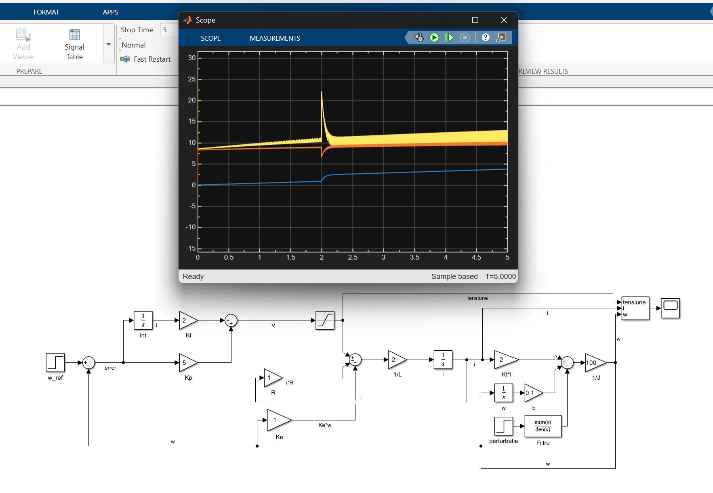

# DC Motor Speed Control (MATLAB/Simulink)

## Description
This project implements a DC motor speed control system using MATLAB/Simulink.

The motor is modeled based on its electrical and mechanical equations, including armature dynamics and rotational motion. A PI controller is used to regulate the motor speed in a closed-loop system.

## Features
- DC motor model based on differential equations
- PI controller for speed regulation
- Closed-loop control system
- Simulation of response to reference changes
- Disturbance analysis

## System Overview
The system includes:
- Electrical model (resistance, inductance, current)
- Mechanical model (inertia, friction, angular speed)
- Back EMF (Ke * ω)
- Torque generation (Kt * i)
- PI controller (Kp, Ki)

## Results
The system was tested in simulation to evaluate:
- Stability
- Response time
- Overshoot
- Behavior under disturbances

## Tools Used
- MATLAB
- Simulink

## Files
- `control_PI_motor_DC.slx` – Simulink model
- `diagram.png` – system block diagram

## Preview

## Notes
This project was developed as part of my learning process in control systems and MATLAB/Simulink.

## Author
Andrei Măcăneață-Vamoș
